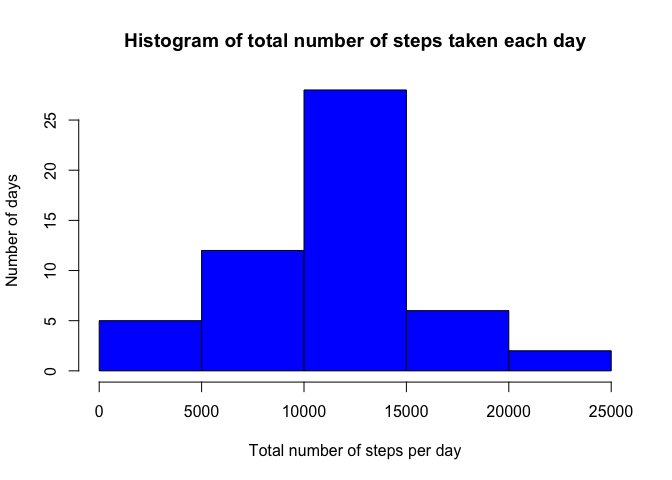
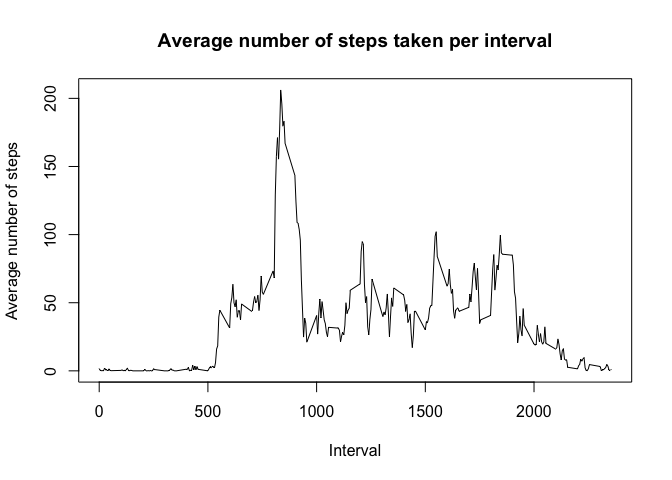
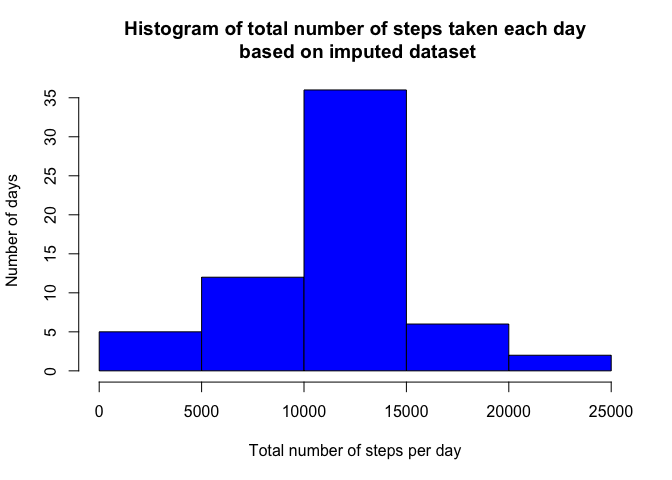
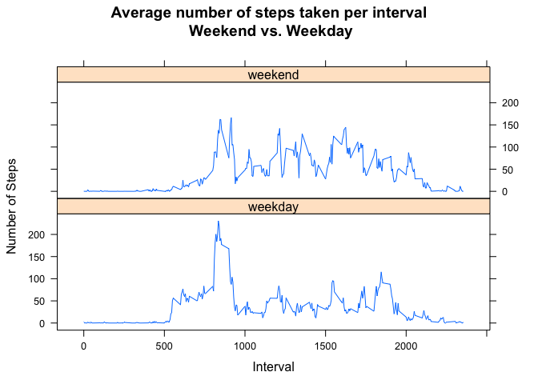

# Reproducible Research: Peer Assessment 1


## Loading and preprocessing the data


```r
# Load the dataset

if (!file.exists("activity.csv")) {
     unzip("activity.zip")
}

activityRaw <- read.csv("activity.csv")

# Preprocess the dataset
# Remove NAs and convert date

activity <- na.omit(activityRaw)
activity$date <- as.Date(activity$date, "%Y-%m-%d")
```


## What is mean total number of steps taken per day?

*Calculate the total number of steps taken per day*  


```r
sumStepsPerDay <- with(activity, aggregate(steps ~ date, FUN = sum))
```

*Make a histogram of the total number of steps taken each day*  
  

```r
hist(sumStepsPerDay$steps, col = "blue", 
     main = "Histogram of total number of steps taken each day", 
     xlab = "Total number of steps per day", 
     ylab = "Number of days"
     )
```

<!-- -->

*Calculate and report the mean and median of the total number of steps taken per day*  


```r
meanStepsPerDay <- round(mean(sumStepsPerDay$steps), 2)
medianStepsPerDay <- median(sumStepsPerDay$steps)
```

**Mean total number of steps taken per day:   10766.19**  
**Median total number of steps taken per day: 10765**  


## What is the average daily activity pattern?

*Make a time series plot (e.e. type = "l") of the 5-minute interval (x-axis) and the average number of steps taken, averaged across all days (y-axis)*  


```r
# Calculate the mean steps per interval

meanStepsPerInterval <- with(activity, aggregate(steps ~ interval, FUN = mean))

# Create time serie plot

with(meanStepsPerInterval, plot(interval, steps, type = "l",
                                main = "Average number of steps taken per interval", 
                                xlab = "Interval", 
                                ylab = "Average number of steps"
                                ))
```

<!-- -->

*Which 5-minute interval, on average across all the days in the dataset, contains the maximum number of steps?*  


```r
maxStepsPerInterval <- meanStepsPerInterval$interval[which.max(meanStepsPerInterval$steps)] 
```

**Interval with the maximum average number of steps taken: 835**  

## Imputing missing values

*Calculate and report the total number of missing values in the dataset (i.e. the total number of rows with NAs)*  


```r
numMissingValue <- sum(is.na(activityRaw$steps))
```

**There are 2304 values missing.**  

*Devise a strategy for filling in all of the missing values in the dataset. The strategy does not need to be sophisticated. For example, you yould use the mean/median for that day, or the mean for that 5-minute interval, etc.*  

All missing values in the activity dataset are to be replaced by the mean for the corresponding 5-minute interval available in the meanStepsPerInterval data frame.  


```r
# Create function to impute missing steps by inserting average steps per interval
# Usage: data_frame_cleaned <- imputeMissingSteps(data_frame_raw)

imputeMissingSteps <- function(x) {
     for (i in which(is.na(x$steps))) {
          x$steps[i] <- meanStepsPerInterval$steps[meanStepsPerInterval$interval == x$interval[i]]
     }
     return(x)
}
```

*Create a new dataset that is equal to the original dataset but with the missing data filled in.*  


```r
activityImputed <- imputeMissingSteps(activityRaw)
```

*Make a histogram of the total number of steps taken each day and Calculate and report the **mean** and **median** total number of steps taken per day. Do these values differ from the estimates from the first part of the assignment? What is the impact of imputing missing data on the estimates of the total daily number of steps?*  


```r
# Calculate total number of steps per interval based on the imputed dataset

sumStepsPerDayImputed <- with(activityImputed, aggregate(steps ~ date, FUN = sum))

# Create histogram 

hist(sumStepsPerDayImputed$steps, col = "blue", 
     main = "Histogram of total number of steps taken each day\n based on imputed dataset", 
     xlab = "Total number of steps per day", 
     ylab = "Number of days"
     )
```

<!-- -->


```r
meanStepsPerDayImputed <- round(mean(sumStepsPerDayImputed$steps), 2)
medianStepsPerDayImputed <- round(median(sumStepsPerDayImputed$steps), 2)
```

**Mean total number of steps taken per day:   10766.19**  
**Median total number of steps taken per day: 10766.19**  

Since we imputed the missing values with the mean total number of steps, there is no change in the mean. Whereas the median is been changed and is now equal to the mean.  

## Are there differences in activity patterns between weekdays and weekends?

*Create a new factor variable in the dataset with two levels - "weekday" and "weekend" indicating whether a given date is a weekday or weekend day.*  


```r
# Convert date vector

activityImputed$date <- as.Date(activityImputed$date, "%Y-%m-%d")

# Create daytype factor indicating weekends and weekdays

activityImputed$daytype <- as.factor(ifelse(weekdays(activityImputed$date) %in% c("Saturday","Sunday"), "weekend", "weekday"))
```

*Make a panel plot containing a time series plot (i.e. type = "l") of the 5-minute interval (x-axis) and the average number of steps taken, averaged across all weekday days or weekend days (y-axis).*  


```r
# Calculate the mean steps per interval and daytype

meanStepsPerIntervalDaytype <- with(activityImputed, aggregate(steps ~ interval + daytype, FUN = mean))

# Load lattice library and create time series plot

library(lattice)
xyplot(steps ~ interval | daytype, data = meanStepsPerIntervalDaytype, type = "l",
       layout = c(1,2), xlab = 'Interval', ylab = 'Number of Steps', 
       main = "Average number of steps taken per interval\n Weekend vs. Weekday"
      )
```

<!-- -->

The activity pattern is different between weekdays and weekends.  
Movement on the weekends starts later in the day with high volatility during the day.  
On weekdays there is a high peak in the morning with lower volatility during the day.  
